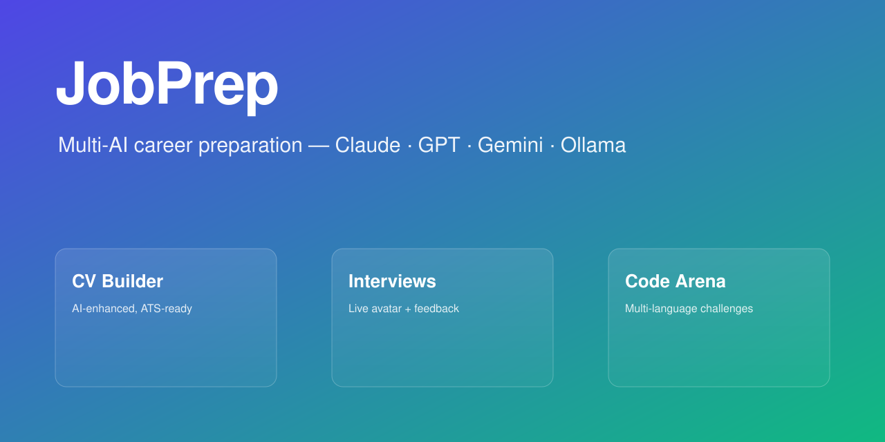
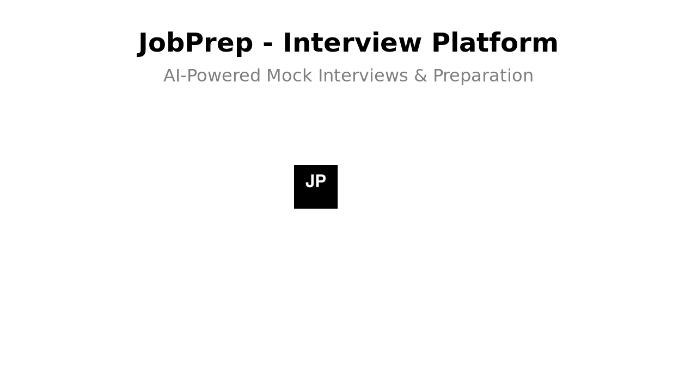

<div align="center">



# JobPrep

### The open-source AI interview-prep platform — multi-LLM mock interviews, **BYOK, self-host, no subscription**

**A free, self-hostable alternative to Final Round AI, Interview Coder & Pramp.**
Bring your own API key (Claude / GPT / Gemini) or run **100% local & offline** with Ollama. Your data stays yours.

[-6C2BD9?style=for-the-badge&logo=cloudflare&logoColor=white)](https://jobprep.pages.dev)
&nbsp;
[](https://deploy.workers.cloudflare.com/?url=https://github.com/aliammari1/JobPrep)
&nbsp;
[](https://github.com/aliammari1/JobPrep)

[](https://github.com/aliammari1/JobPrep/actions/workflows/ci.yml)
[](https://github.com/aliammari1/JobPrep/actions/workflows/codeql.yml)
[](https://securityscorecards.dev/viewer/?uri=github.com/aliammari1/JobPrep)
[](https://nextjs.org/)
[](https://react.dev/)
[](LICENSE.md)

</div>

> **▶ 60-second demo** — _GIF coming soon_ (see [`BANNER.md`](BANNER.md) for the recording brief).
> <br>

---

## Why JobPrep vs. paid interview-prep tools

Most interview-prep tools lock you into one AI vendor, charge a monthly subscription, and keep your practice data on their servers. JobPrep flips all three.

| | **JobPrep** | Final Round AI / Interview Coder / Pramp |
| --- | :---: | :---: |
| **Price** | **$0** — self-host / BYOK | ~$96–$149 / month |
| **AI models** | **Claude · GPT · Gemini · Ollama** (swap per request) | Single vendor, fixed |
| **API keys** | **Bring your own** (or run local) | Vendor-controlled |
| **Self-host** | ✅ Cloudflare / Docker / your box | ❌ |
| **Run offline / local** | ✅ Ollama, fully private | ❌ |
| **Source code** | ✅ Source-available, auditable | ❌ Closed |
| **Your data** | ✅ Stays in your own DB | ❌ On their servers |
| **Mock interviews** | ✅ Live video (LiveKit) + AI feedback | ✅ |
| **CV builder + coding arena** | ✅ Included | Partial / extra |

> **The pitch in one line:** the practice quality of a $149/mo product, for **$0**, with **your** keys and **your** data.

---

## ⚡ Try it in minutes (BYOK)

No vendor account, no subscription — just your own API key (or none, with local Ollama):

```bash
git clone https://github.com/aliammari1/JobPrep.git && cd JobPrep
bun install
cp .env.example .env          # add ONE key: ANTHROPIC_API_KEY=... (or OPENAI / GEMINI)
bun run prisma:generate && bun run prisma:migrate
bun run dev                   # → http://localhost:3000
```

**Zero API keys?** Set `AI_COACH_DEFAULT_MODEL=ollama:llama3.2` and run a local
[Ollama](https://ollama.com) — JobPrep then runs **fully offline and private**.
The only required vars are `DATABASE_URL` + `BETTER_AUTH_SECRET`; everything else
(AI, video, billing) is optional and feature-gated.

### 🧱 Use it as a starter

JobPrep is a **GitHub [template repository](https://docs.github.com/repositories/creating-and-managing-repositories/creating-a-repository-from-a-template)** —
hit **Use this template** to spin up your own multi-LLM interview-prep app (or
any BYOK AI product) with auth, billing, Prisma, rate-limiting and observability
already wired. Then deploy your own copy:

[](https://deploy.workers.cloudflare.com/?url=https://github.com/aliammari1/JobPrep)

The web app runs on Cloudflare Workers/Pages (see [`docs/DEPLOYMENT.md`](docs/DEPLOYMENT.md));
the long-running LiveKit avatar agent runs on a container next to LiveKit Cloud.

---

## 🎯 What's inside

- 🤖 **Multi-LLM AI coach** — Claude, GPT-4, Gemini, or local Ollama, switchable per request (BYOK)
- 🎥 **Live video mock interviews** — LiveKit WebRTC + AI feedback on answers, tone & body language
- 📄 **ATS-friendly CV builder** — 3 templates, LinkedIn import (Chrome extension), multi-format export
- 💻 **Coding arena** — practice in 15+ languages with instant evaluation
- ✍️ **AI cover letters** tailored to a job description
- 📊 **Progress analytics** + 🔐 **passkey auth & 2FA**

---

## 🤔 Provider-agnostic AI (how BYOK works)

The **AI Coach** resolves a model at request time from a single
`<provider>:<model>` id, so you switch between **Claude, GPT, Gemini, or a
self-hosted Ollama** model — including fully local/offline — without touching any
feature code.

| Want… | Pick |
| --- | --- |
| Fast & cheap (default) | `anthropic:claude-haiku-4-5` |
| Highest quality | `anthropic:claude-sonnet-4-5` / `openai:gpt-4o` |
| Free/local & private | `ollama:llama3.2` |

```bash
# Stream a coaching reply (omit "model" to use the default)
curl -N -X POST http://localhost:3000/api/ai/coach \
  -H 'content-type: application/json' \
  -d '{"messages":[{"role":"user","content":"STAR-review my answer"}],"model":"anthropic:claude-haiku-4-5"}'
```

List available models at `GET /api/ai/models`. Adding a new provider is a
three-line change in `src/lib/ai/providers.ts`.

---

## 🏗️ Architecture

```
┌─────────────────────────────────────────────────────────────────┐
│                         Frontend Layer                          │
│  Next.js 15 • React 19 • TypeScript • Tailwind CSS • shadcn/ui │
└────────────────────────┬────────────────────────────────────────┘
                         │
┌────────────────────────┴────────────────────────────────────────┐
│                      API Routes Layer                           │
│     /api/ai • /api/interviews • /api/cv • /api/challenges      │
└────────────────────────┬────────────────────────────────────────┘
                         │
┌────────────────────────┴────────────────────────────────────────┐
│                    AI Services Layer                            │
│   Gemini • OpenAI • Claude • Ollama • HeyGen • MediaPipe       │
└────────────────────────┬────────────────────────────────────────┘
                         │
┌────────────────────────┴────────────────────────────────────────┐
│                   Real-time Services                            │
│        LiveKit (Video) • Liveblocks • Socket.io                │
└────────────────────────┬────────────────────────────────────────┘
                         │
┌────────────────────────┴────────────────────────────────────────┐
│                    Data & Storage Layer                         │
│   PostgreSQL (Prisma) • Appwrite • Cloudinary • Stripe         │
└─────────────────────────────────────────────────────────────────┘
```

---

## 🌟 Features

### 🎤 AI Mock Interviews

| Feature | Description |
|---------|-------------|
| **Multi-AI Support** | Choose between Gemini, GPT-4, Claude, or local Ollama |
| **Real-time Video** | LiveKit-powered HD video/audio with screen sharing |
| **Smart Questions** | AI generates role-specific technical & behavioral questions |
| **Instant Feedback** | Get detailed analysis of answers, tone, and body language |
| **Voice Analysis** | Speech-to-text transcription with emotion detection |
| **Recording** | Save interviews for review and improvement tracking |
| **Scheduling** | Google Calendar integration for practice sessions |

### 📄 CV Builder

| Feature | Description |
|---------|-------------|
| **3 Templates** | Professional, modern, and creative ATS-optimized designs |
| **LinkedIn Import** | Chrome extension auto-fills CV from LinkedIn profile |
| **Smart Suggestions** | AI-powered improvements for bullet points and keywords |
| **Multi-format Export** | PDF, DOCX, JSON with customizable styling |
| **Version Control** | Save multiple versions, track changes over time |
| **Real-time Preview** | Live updates as you type with mobile-responsive view |

### 💻 Code Challenges

| Feature | Description |
|---------|-------------|
| **15+ Languages** | Java, Python, JavaScript, C++, Go, Rust, and more |
| **Difficulty Levels** | Easy, Medium, Hard with curated problem sets |
| **Real-time Execution** | Piston API-powered instant code evaluation |
| **Test Cases** | Run against multiple test cases with detailed feedback |
| **Leaderboard** | Compete with others, track rankings and statistics |
| **Time Tracking** | Practice under interview conditions with timers |

### ✍️ Cover Letter Generator

AI-powered cover letter creation tailored to job descriptions using Gemini & GPT-4 with customizable tone and multiple revisions.

### 🔌 Chrome Extension

One-click LinkedIn CV import - automatically extracts work experience, education, skills, and certifications into JobPrep format.

---

## 🛠️ Technology Stack

### Frontend
- **Next.js 15.5** - React framework with App Router & Server Components
- **React 19.1** - UI library with React Compiler
- **TypeScript 5** - Type safety
- **Tailwind CSS 4.0** - Utility-first styling
- **shadcn/ui** - Beautiful accessible components
- **Framer Motion** - Smooth animations

### Backend
- **Node.js 20+** - JavaScript runtime
- **Prisma 6.17** - Type-safe ORM
- **PostgreSQL** - Primary database
- **Better Auth 1.3** - Authentication with passkeys & 2FA

### AI & ML
- **Google Gemini** - Primary AI for interviews & CV analysis
- **OpenAI GPT-4** - Advanced reasoning & code evaluation
- **Anthropic Claude** - Alternative AI provider
- **Ollama** - Local AI models (optional)
- **HeyGen** - AI avatar generation
- **MediaPipe** - Body language & emotion analysis

### Real-time & Media
- **LiveKit** - WebRTC video/audio conferencing
- **Socket.io** - Real-time notifications
- **Liveblocks** - Collaborative features

### Storage & Services
- **Appwrite** - File storage & backend services
- **Cloudinary** - Image optimization & CDN
- **Stripe** - Payment processing & subscriptions

### Document Processing
- **pdf-lib** - PDF manipulation
- **mammoth** - DOCX parsing

### Code Execution
- **Piston API** - Multi-language code runner (15+ languages)

---

## 🚀 Quick Start

See [**⚡ Try it in minutes (BYOK)**](#-try-it-in-minutes-byok) above for the
2-minute path. **Prerequisites:** Bun 1.x (this repo is Bun, not npm/pnpm),
PostgreSQL 14+, Git. Optional: [uv](https://docs.astral.sh/uv/) for the Python
avatar agent in `functions/`.

**Environment variables:** the canonical, commented list lives in
[`.env.example`](.env.example). Only `DATABASE_URL` + `BETTER_AUTH_SECRET` are
required; AI providers (BYOK), LiveKit video, Stripe billing, Upstash
rate-limiting and Sentry are all optional and feature-gated.

---

## 📁 Project Structure

```
JobPrep/
├── src/
│   ├── app/                    # Next.js App Router
│   │   ├── (auth)/            # Auth pages (login, register)
│   │   ├── (dashboard)/       # Protected dashboard routes
│   │   ├── api/               # API routes (35+ endpoints)
│   │   │   ├── ai/           # AI chat & processing
│   │   │   ├── interviews/   # Mock interview endpoints
│   │   │   ├── cv/           # CV builder & export
│   │   │   ├── challenges/   # Code challenge submission
│   │   │   ├── livekit/      # Video conferencing
│   │   │   └── stripe/       # Payment webhooks
│   │   └── layout.tsx        # Root layout
│   ├── components/            # React components (150+)
│   │   ├── ui/               # shadcn/ui components
│   │   ├── interviews/       # Interview-related components
│   │   ├── cv/               # CV builder components
│   │   └── challenges/       # Code editor components
│   ├── lib/                  # Utilities & helpers
│   │   ├── prisma.ts        # Database client
│   │   ├── auth.ts          # Auth configuration
│   │   └── ai/              # AI service integrations
│   └── styles/              # Global styles
├── prisma/
│   └── schema.prisma        # Database schema (25+ models)
├── chrome-extension/        # LinkedIn CV importer
│   ├── manifest.json
│   ├── content.js          # LinkedIn scraper
│   └── popup.html          # Extension UI
├── public/                 # Static assets
└── package.json           # Dependencies (80+)
```

---

## 💾 Database Schema

```prisma
model User {
  id            String          @id @default(cuid())
  email         String          @unique
  name          String?
  image         String?
  interviews    Interview[]
  cvs           CV[]
  submissions   Submission[]
  subscription  Subscription?
  createdAt     DateTime        @default(now())
}

model Interview {
  id            String              @id @default(cuid())
  userId        String
  user          User                @relation(fields: [userId], references: [id])
  jobTitle      String
  jobDescription String
  difficulty    Difficulty
  aiProvider    AIProvider
  questions     Question[]
  responses     InterviewResponse[]
  recordingUrl  String?
  score         Float?
  feedback      String?
  status        InterviewStatus     @default(PENDING)
  scheduledAt   DateTime?
  completedAt   DateTime?
  createdAt     DateTime            @default(now())
}

model CV {
  id            String      @id @default(cuid())
  userId        String
  user          User        @relation(fields: [userId], references: [id])
  template      String
  personalInfo  Json
  experience    Json[]
  education     Json[]
  skills        Json[]
  certifications Json[]
  createdAt     DateTime    @default(now())
  updatedAt     DateTime    @updatedAt
}

model Challenge {
  id            String       @id @default(cuid())
  title         String
  description   String
  difficulty    Difficulty
  language      String
  testCases     Json[]
  submissions   Submission[]
  tags          String[]
  createdAt     DateTime     @default(now())
}

model Subscription {
  id            String   @id @default(cuid())
  userId        String   @unique
  user          User     @relation(fields: [userId], references: [id])
  plan          Plan
  status        String
  stripeId      String   @unique
  currentPeriodEnd DateTime
}
```

---

## 🎨 Screenshots

<div align="center">

### 🖥️ Desktop Experience

*Full desktop dashboard experience*

### 📱 Mobile Experience

*Responsive mobile interface*

</div>

---

## 🔐 Security

- 🔒 **Modern auth** — Better Auth with passkeys & 2FA
- 🚫 **Rate limiting** — Upstash sliding-window limits on the AI + LiveKit endpoints (`src/lib/rate-limit.ts`)
- 🧰 **Typed env** — boot-time validation via `@t3-oss/env-nextjs` + Zod (`src/env.ts`)
- 📋 **Security headers / CSP** — HSTS, X-Frame-Options, `script-src` without `unsafe-eval` in prod (`next.config.mjs`)
- 💳 **Idempotent Stripe webhooks** — duplicate-delivery ledger so retries are safe
- 📈 **Observability** — Sentry + OpenTelemetry, with AI-SDK telemetry (token/cost) — all no-ops unless configured
- ✅ **SQL-injection safe** (Prisma) · **XSS** (React) · **CSRF** (built-in)
- 🔎 **Automated scanning** — CodeQL, gitleaks, Trivy, dependency-review + OpenSSF Scorecard in CI

---

## 📖 API Reference

- **Interactive (Scalar):** run the app and open [`/api-docs`](/api-docs).
- **OpenAPI document:** [`/api/openapi`](/api/openapi) (also generated to
  `openapi.json` via `bun run openapi:generate`).
- New endpoints are documented by adding a `@swagger` JSDoc block above the route
  handler — `next-swagger-doc` picks them up automatically.

---

## ☁️ Deploy to Cloudflare

[](https://deploy.workers.cloudflare.com/?url=https://github.com/aliammari1/JobPrep)

The Next.js app deploys to **Cloudflare** via `@opennextjs/cloudflare`, with
PostgreSQL reached through **Hyperdrive**. Config lives in `wrangler.jsonc` +
`open-next.config.ts`; deployment is gated behind a manual workflow.

```bash
bun add -D @opennextjs/cloudflare
bunx @opennextjs/cloudflare build
bunx wrangler deploy
```

> ⚠️ **Two-part deploy.** The Python **LiveKit/Simli avatar agent** (`functions/`)
> is a long-running WebRTC process — it **cannot** run on Cloudflare Workers. The
> web app runs on Cloudflare; the agent runs on a container next to **LiveKit
> Cloud** (free Build tier). Full host comparison (LiveKit Cloud agents, Railway,
> Render, Fly.io, Koyeb — researched for 2026) is in
> [`docs/DEPLOYMENT.md`](docs/DEPLOYMENT.md).

**More docs:** [Deployment](docs/DEPLOYMENT.md) ·
[Architecture](docs/ARCHITECTURE.md) ·
[Chrome Web Store publishing](docs/CHROME_WEB_STORE.md) ·
[Banner / social preview](BANNER.md) ·
[Launch checklist](docs/TRENDING.md)

---

## 🧭 Engineering Decisions

- **Bun + Biome (no ESLint/Prettier).** One fast toolchain for install, lint, and
  format; `biome ci` runs in CI with a blocking format check.
- **Source-Available license kept** (SPDX `LicenseRef-Source-Available-1.0`) —
  JobPrep is a commercial product, not a permissive OSS sample.
- **Provider-agnostic AI** on the Vercel AI SDK with a model registry, rather than
  hard-wiring one vendor — enables Claude/GPT/Gemini/Ollama and offline use.
- **Hyperdrive, not D1**, for the database: the Prisma schema is Postgres-specific
  and Better-Auth uses the Postgres adapter, so a SQLite port would be high-risk.
- **Lazy Stripe init** so `next build` doesn't require live billing keys in CI.
- **Scoped, ratcheting test coverage** instead of a global 80% gate that failed CI.
- **Avatar agent on a container** (uv + ruff + pytest), honestly documented as a
  non-Workers workload.

---

## 🗺️ Roadmap

### ✅ Completed (v1.0)
- [x] AI-powered mock interviews with multi-provider support
- [x] Professional CV builder with 3 templates
- [x] Code challenge arena (15+ languages)
- [x] Chrome extension for LinkedIn import
- [x] Real-time video interviews (LiveKit)
- [x] Stripe payment integration
- [x] Dashboard & analytics

### 🚧 In Progress (v1.1 - Q1 2026)
- [ ] 🎓 AI interview coaching with personalized tips
- [ ] 📊 Advanced analytics & skill gap analysis
- [ ] 🎮 Gamification & achievement system
- [ ] 🌍 Multi-language support (i18n)
- [ ] 📱 Mobile responsive improvements

### 🔮 Planned (v2.0 - Q2 2026)
- [ ] 🥽 VR Interview simulation
- [ ] 📱 iOS & Android mobile apps
- [ ] 👥 Peer interview matching
- [ ] 🎓 Interview coaching marketplace
- [ ] 🧠 Emotion detection & personality analysis
- [ ] 🏢 Company-specific prep (FAANG, startups)
- [ ] 🤝 ATS integration & job application tracking

---

## 🤝 Contributing

Contributions are welcome! See our [Contributing Guide](CONTRIBUTING.md) for details.

```bash
# Fork & clone
git clone https://github.com/YOUR_USERNAME/JobPrep.git

# Create branch
git checkout -b feature/amazing-feature

# Commit changes
git commit -m 'feat: add amazing feature'

# Push & create PR
git push origin feature/amazing-feature
```

### Commit Convention
- `feat:` New feature
- `fix:` Bug fix
- `docs:` Documentation
- `refactor:` Code refactoring
- `test:` Adding tests
- `chore:` Maintenance

---

## 📄 License

This project is licensed under the [Source-Available License 1.0](LICENSE.md)
(SPDX: `LicenseRef-Source-Available-1.0`).

- **Free for**: Personal use, education, research, non-profits, and security research
- **Commercial use**: Requires a Commercial License. Contact [ammari.ali.0001@gmail.com](mailto:ammari.ali.0001@gmail.com)

This is a source-available license. It is NOT an Open Source Initiative (OSI) approved open-source license.

Copyright (c) 2026 Ali Ammari

---

## 👨‍💻 Author

<div align="center">

### **Ali Ammari**

[](https://github.com/aliammari1)
[](https://linkedin.com/in/aliammari1)
[](https://twitter.com/aliammari1)
[](https://aliammari.dev)

**Full-Stack Developer | AI Enthusiast | Open Source Contributor**

</div>

---

## 🙏 Acknowledgments

Special thanks to:
- [Next.js](https://nextjs.org/) - The React Framework
- [Cloudflare](https://www.cloudflare.com/) - Edge deployment & hosting
- [Prisma](https://prisma.io/) - Next-gen ORM
- [shadcn/ui](https://ui.shadcn.com/) - Beautiful Components
- [LiveKit](https://livekit.io/) - Real-time Video
- [Better Auth](https://better-auth.com/) - Modern Auth
- [Google AI](https://ai.google.dev/) - Gemini API
- [OpenAI](https://openai.com/) - GPT Models
- [Stripe](https://stripe.com/) - Payments

---

## ⭐ Support

If JobPrep saves you a $149/mo subscription, the best thank-you is a star:

[](https://github.com/aliammari1/JobPrep)

- ⭐ **Star the repo** so others discover the free alternative
- 🐦 **Share it** with anyone grinding interviews
- ☕ **[Buy me a coffee](https://buymeacoffee.com/aliammari)**

---

## 🔗 Related open-source projects

Part of a wider open-source ecosystem — if JobPrep is useful, these might be too:

- 📚 [**readrealm**](https://github.com/aliammari1/readrealm) — open-source AI book-chat (Speechify / Blinkist alternative)
- 🩺 [**pulmocare**](https://github.com/aliammari1/pulmocare) — open-source, self-hostable chest-X-ray AI agent
- 📊 [**github-traffic-analytics**](https://github.com/aliammari1/github-traffic-analytics) — keep your repo traffic past GitHub's 14-day window
- 🧰 [**awesome-ai-tools**](https://github.com/aliammari1/awesome-ai-tools) — a curated index of ~400 AI tools

---

<div align="center">

### 📈 Star History

[](https://star-history.com/#aliammari1/JobPrep&Date)

---

**Built with ❤️ by [Ali Ammari](https://github.com/aliammari1)**

*Helping job seekers land their dream jobs, one interview at a time* 🚀

---


</div>
